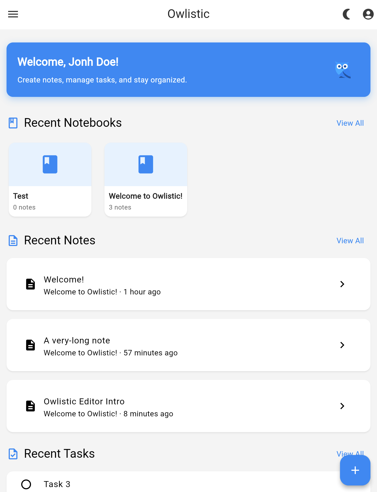
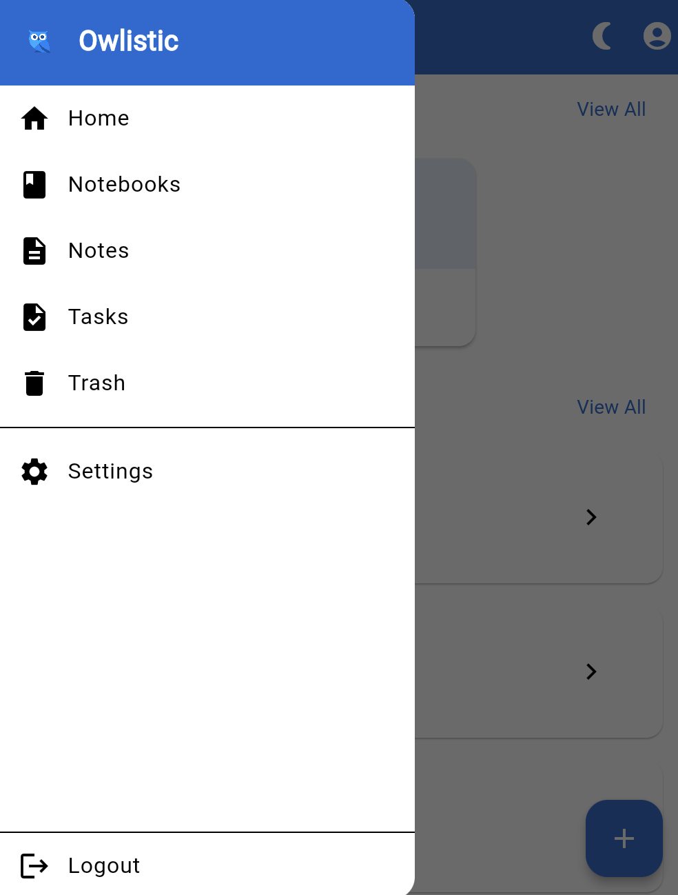
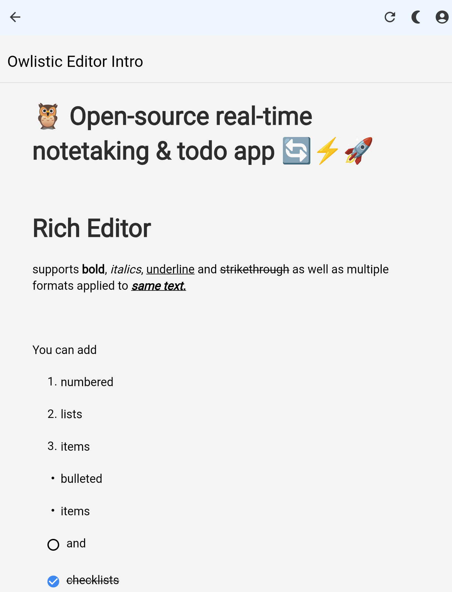
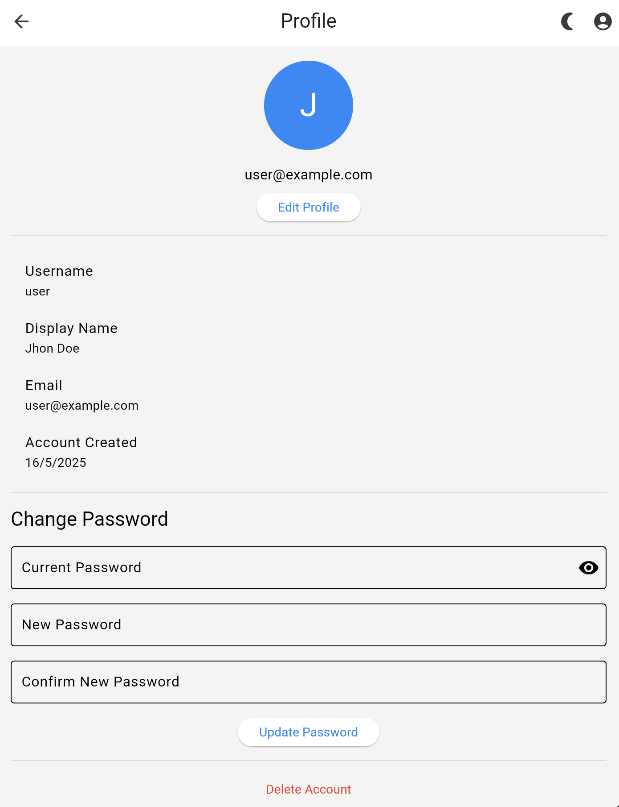

  
  
  # 🦉 Open-source real-time notetaking & todo app 🔄⚡️🚀

  
  
  
  

  

## Table of Contents

- [Quick Links](#quick-links)
- [Screenshots](#screenshots)
- [Features](#features)
- [Installation](#install)
- [Maintainers](#maintainers)
- [Contributing](#contributing)
- [License](#license)

## Quick Links

- [Installation](https://owlistic-notes.github.io/owlistic/docs/category/installation)
- [Quick Start](https://owlistic-notes.github.io/owlistic/docs/overview/quick-start)
- [FAQ](https://owlistic-notes.github.io/owlistic/docs/troubleshooting/faq)
<!--
- [Api Reference](https://owlistic-notes.github.io/owlistic/docs/category/api-reference)
-->

## Screenshots

### App Home

### Editor

#### Editor Toolbar

### Other Screens

#### Notebook

#### Notes

#### Trash

#### Profile

## Features

- 📒 Notebooks/Notes tree
- ✏️ Rich (WYSIWYG) editor
- ✔️ Inline todo items
- 🔄 Real-time sync
- 🔑 JWT-based auth
- 🔒 Role-based access control
- 🗑 Trash
- 🌓 Dark/Light mode
- ⬇️ Import markdown note

Please have a look at the [features](https://owlistic-notes.github.io/owlistic/docs/category/features) for details.

## Install

Spin up Owlistic in minutes using your preferred [installation method](https://owlistic-notes.github.io/owlistic/docs/category/installation).

## Maintainers

- [@Davide Rutigliano](https://github.com/DavideRutigliano)

## Contributing

Owlistic is developed by the community, for the community. We welcome contributions of all kinds - from code improvements to documentation updates. Check out our [Contributing Guide](https://owlistic-notes.github.io/owlistic/docs/category/contributing) to learn how you can help.

Small note: If editing the README, please conform to the
[standard-readme](https://github.com/RichardLitt/standard-readme) specification.

## License

GPLv3.0 © 2025 owlistic-notes
