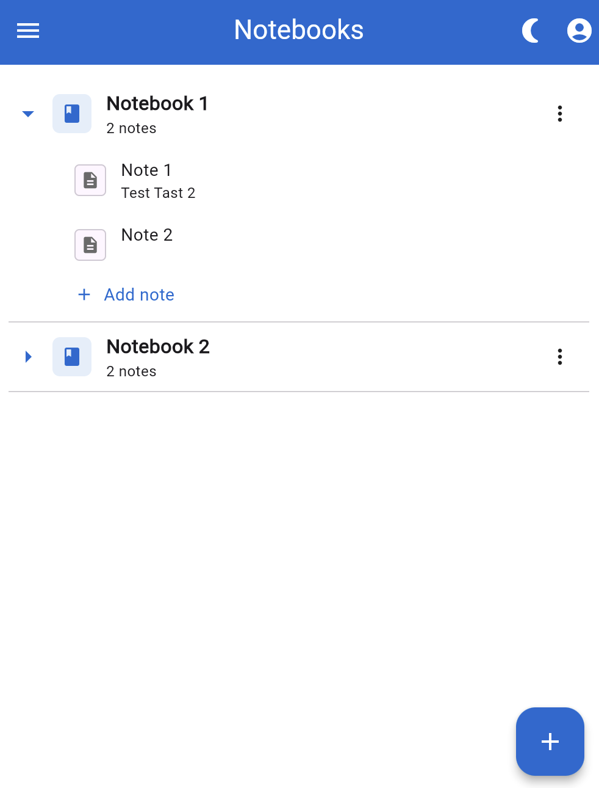
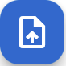

# Quick Start

Welcome to the Quick Start Guide! This guide will help you get it up and running.

## Installation

Before you begin, ensure that you have completed the installation process using your preferred [install option](/docs/category/installation).

## Launch the Application

Once installed, you can launch the application you can access Owlistic at `http://your-website` or using [Progrssive Web App](https://en.wikipedia.org/wiki/Progressive_web_app) (PWA).

:::info

Stay tuned for Mobile and Desktop apps soon!

:::

## Register into Owlistic

## Login into Owlistic

## Organize notes in Notebooks

## Notes

## Edit a note

### Import from Markdown file

## Add tasks

## Trash

## Explore Features

- 📒 Notebooks/Notes tree
- ✏️ Rich (WYSIWYG) editor
- 📋 Inline todo items
- 🔄 Real-time sync
- 🔑 JWT-based auth
- 🔒 Role-based access control
- 🗑️ Trash
- 🌗 Dark/Light mode
- ⬆ Import markdown notes

## What's next?

TODO